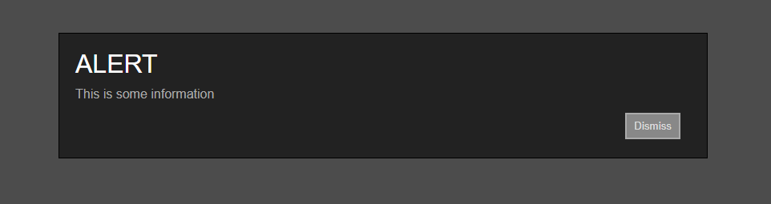
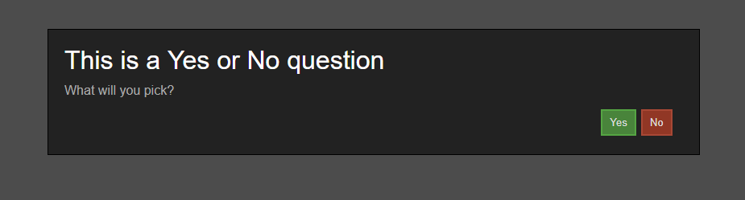
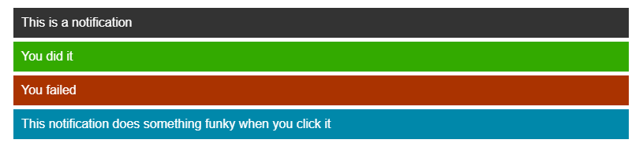

# Alerts & Notifications

## Demos

#### [Alerts demo](https://codepen.io/inet/pen/YBMqBE) // [Notifications demo](https://codepen.io/inet/pen/LqvvGX)



## Setup

Regardless of what you're doing, you're gonna need to import the JS and CSS files:

```text
<script type="text/javascript" src="alerts.js"></script>
<link rel="stylesheet" href="alerts.css" />
```

## Alerts

The basic format of the `makeAlert()` function is: `makeAlert(<type>, { header: "Header text", contents: "Body text" });` ...Where:

`header` is the big title text at the top of the alert.

`contents` parameter is the body text.


I'd recommend taking a look at the demo above before continuing, to get an idea of what these look like.


### Info Alert

An information alert contains just a header and body with a "Dismiss" button. These are the simplest alerts to create, as they only contain 2 customisable elements:

```text
makeAlert("info", {
  header: 'ALERT',
  contents: 'This is some information'
});
```



### Confirmation Alert

These alerts are a little more spicy, as similar to the built-in `confirm()` function, you _can_ specify a yes/no question and act accordingly. The options are a lot more open, however, and I'd recommend putting them inside their own functions since they can get pretty big.



```text
makeAlert("confirm", {
  header: "This is a Yes or No question",
  contents: "What will you pick?",
  options: [
    {
      label: "Yes",
      style: "btn-green",
      funct: function() {
        // yes
        alert("You clicked Yes.");    
      }
    },
    {
      label: "No",
      style: "btn-red"
    }
  ]
});
```

Let's break this down:

We have the standard `header` and `contents` parameters, however we also have the `options` parameter. This is your buttons; "yes" and "no", or whatever.

* `label` is the text that appears on the button.
* `style` is optional; this is a class that will be added to the button, such as a colour \(`btn-grey`, `btn-green` and `btn-red` are included in the CSS file; the default is `btn-grey`\).
* `funct` is also optional; this is whatever function will be executed if and when the user clicks the button. By default, this just dismisses the alert, but you can do whatever with it.

## Notifications / Toasts

These are smaller notifications that pop up and then disappear after a while \(5 seconds in this case\). Again, if you're confused, check the demo at the top.



To start, import the JS and CSS files as usual:

```text
<script type="text/javascript" src="notifications.js"></script>
<link rel="stylesheet" href="notifications.css" />
```

These are much simpler to implement than the alerts. All you need for a basic notification is this:

```text
makeNotif('This is a notification');
```

You can get a little fancier though; it takes a second parameter in the form of an object:

```text
makeNotif(
  "This notification does something funky when you click it", 
  {
    type: "info",
    funct: function() {
      alert("bazinga");
    }
  }
);
```

There are currently two \(2\) parameters you can put in here.

* `type` is the the class that gets added. Packaged in the CSS file are `info` \(default\), `success` and `error`. All these do is change the colour of the notification, but you can get creative with it.
* `funct` is an optional function that gets called when the notification is clicked \(`mouseDown`, specifically\). There will always be a function that hides the notification, but you can specify anything else here \(eg. a redirect to another page, via `window.location`\).


If you encounter any problems or bugs, leave a post [here](https://github.com/IEVEVO/web-utils/issues).


