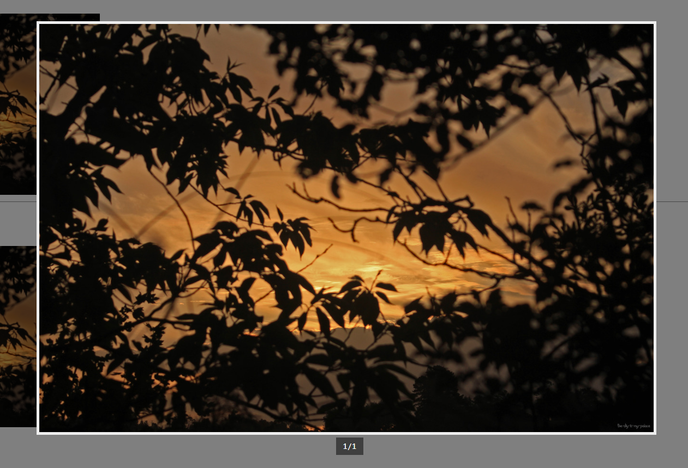
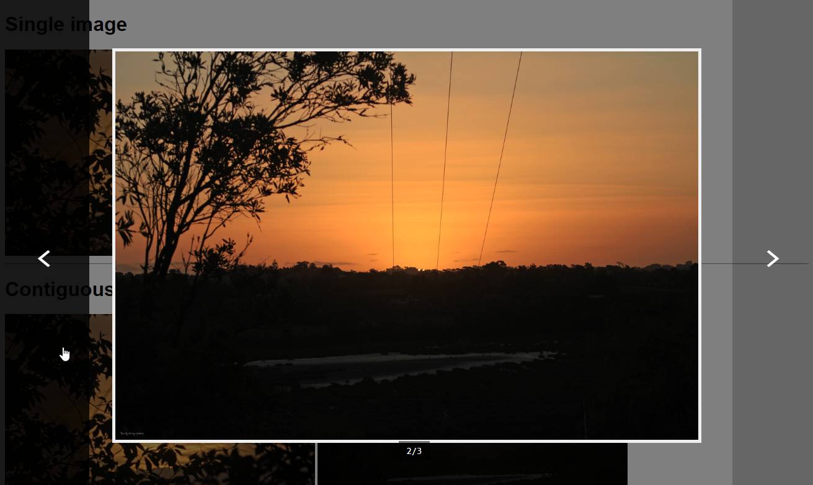

# Image lightbox

## [Demo](https://codepen.io/inet/pen/MLxMwK)



## Usage

First, you'll need to load the .JS and .CSS files. Place these lines somewhere between the `<head>` and `</head>` tags:

```text
<script src="enlargeGallery.js" type="text/javascript"></script>
<link href="enlargeGallery.css" rel="stylesheet" />
```

Next, you'll want to format your images as below:

```text
<div class="gallery">
    
    
    
</div>
```

The important bits are that the outer `<div>` tag has the class `gallery`, and none of the `` tags are nested \(ie. wrapped in another `<div`, or something\).



That's it! Try clicking the images and a full-size version should appear on screen.


Feel free to fiddle with the CSS transitions as you please; they're just what I set up for testing.


### Multiple-Image Galleries

Sometimes your gallery will have more than one image, and closing and re-opening the dialog to view each one just isn't efficient. Luckily, there's a way around that:

```text
<div class="gallery">
    
    
    
</div>
```

Simply give each image a `data-gallery-index` parameter and label the sequence!

Be careful: the counting starts from `0` rather than `1`. Also make sure you don't skip numbers or anything, it doesn't like that.




If you encounter any problems or bugs, leave a post [here](https://github.com/IEVEVO/web-utils/issues).


