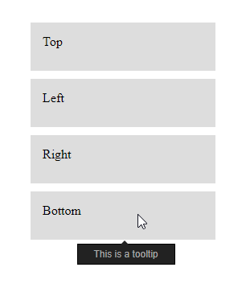

# Static tooltips \(beta\)

## [Demo](https://codepen.io/inet/pen/KEXypL)






Please note that this is currently a beta project, so it may not work as intended in certain environments.


## Setup

First, you'll need to load the .JS and .CSS files. Place these lines somewhere between the `<head>` and `</head>` tags:

```markup
<script type="text/javascript" src="staticTooltips.js"></script>
<link rel="stylesheet" href="staticTooltips.css" />
```

## Usage

There are three things you need to add to your element for a tooltip to appear.

1. `class=give-static-tooltip` \(this is configurable to anything, in the options\).
2. `data-tooltip="Text"`, where "Text" is whatever you want to be displayed inside the tooltip. You can  _technically_ use HTML in here, but it might look a little funky.
3. `data-tooltip-side="x"` , where "x" is one of: `top`, `right`, `bottom`, `left`.

For example:

```markup
<div class="give-static-tooltip" data-tooltip="Tooltip text" data-tooltip-side="right">
    Sample text
</div>
```

This is all you need to add tooltips to your site!


If you encounter any issues, leave a post [here](https://github.com/IEVEVO/web-utils/issues).


