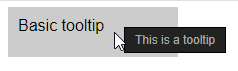

# Tooltips

## [Demo](https://codepen.io/inet/pen/VgRoqe)





## Usage

First, you'll need to load the .JS and .CSS files. Place these lines somewhere between the `<head>` and `</head>` tags:

```text
<script type="text/javascript" src="tooltips.js"></script>
<link rel="stylesheet" href="tooltips.css" />
```

Then, on the element you want the tooltip to appear on, add the class `give-tooltip`. Then, write whatever message you want displayed in the tooltip inside an attribute called `data-tooltip` \(see example below\):

```text
<div class="give-tooltip" data-tooltip="This is a tooltip">Basic tooltip</div>
```

This should be all you need! You can change the look of the tooltip in the .CSS file.


If you encounter any problems or bugs, leave a post [here](https://github.com/IEVEVO/web-utils).


